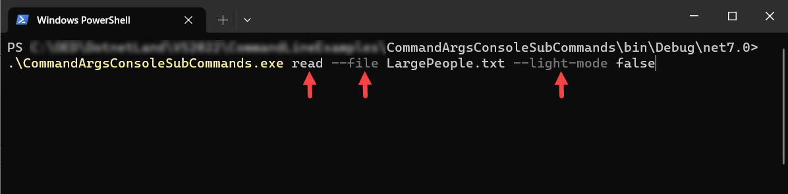

# About

This project was taken from a [Microsoft example](https://learn.microsoft.com/en-us/dotnet/standard/commandline/get-started-tutorial) and modified.

> **Note**
> Microsoft example is good but needed some tweaks. Recommended to read the [docs](https://learn.microsoft.com/en-us/dotnet/standard/commandline/get-started-tutorial)


Run from the command line

```
.\CommandArgsConsoleSubCommands.exe read --file LargePeople.txt --light-mode false
```



- read is a verb
- --file is a command to the read verb which expects a file name to read from disk
- --light-mode specifies the fore color using [Spectre.Console](https://spectreconsole.net/) NuGet package.