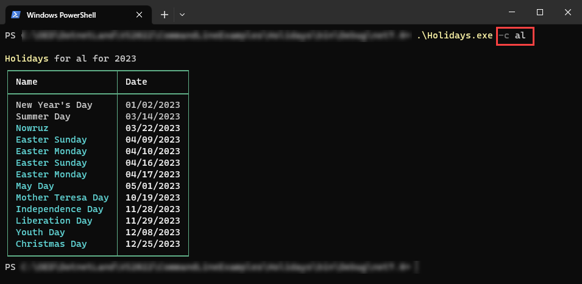

# About

An example to get holidays from NuGet package [Nager.Date](https://www.nuget.org/packages/Nager.Date/1.35.0?_src=template) library.




**Startup code**

This code follows the same pattern as in CommandArgsConsoleApp2 project except the main code is asynchronous.


```csharp
internal partial class Program
{
    static async Task Main(string[] args)
    {
        var environmentOption = new Option<string>("--code")
        {
            Description = "Two letter country code",
            IsRequired = true
        };
        environmentOption.AddAlias("-c");

        RootCommand rootCommand = new("Get holidays for country in current year")
        {
            environmentOption
        };

        rootCommand.SetHandler(MainOperations.Run, environmentOption);
            
        var commandLineBuilder = new CommandLineBuilder(rootCommand);

        commandLineBuilder.AddMiddleware(async (context, next) =>
        {
            await next(context);
        });

        commandLineBuilder.UseDefaults();
        Parser parser = commandLineBuilder.Build();

        await parser.InvokeAsync(args);
    }
}
```

**Base code**

```csharp
internal class Operations
{
    public static async Task Run(string countryCode = "US")
    {
        var jsonSerializerOptions = new JsonSerializerOptions { PropertyNameCaseInsensitive = true };

        using var httpClient = new HttpClient();
        
        var response = await httpClient.GetAsync(
            $"https://date.nager.at/api/v3/publicholidays/{DateTime.Now.Year}/{countryCode}");

        if (response.IsSuccessStatusCode)
        {
            await using var jsonStream = await response.Content.ReadAsStreamAsync();
            var publicHolidays = JsonSerializer.Deserialize<PublicHoliday[]>(jsonStream, jsonSerializerOptions);
            
            AnsiConsole.MarkupLine($"[yellow]Holidays[/]");

            var table = new Table()
                .RoundedBorder()
                .AddColumn("[b]Name[/]")
                .AddColumn("[b]Date[/]")
                .Alignment(Justify.Left)
                .BorderColor(Color.LightSlateGrey);

            foreach (var holiday in publicHolidays!)
            {

                if (holiday.Date.Month == DateTime.Now.Month)
                {
                    table.AddRow($"[cyan]{holiday.Name}[/b]", $"[cyan]{holiday.Date:MM/dd/yyyy}[/]");
                }
                else
                {
                    table.AddRow(holiday.Name, holiday.Date.ToString("MM/dd/yyyy"));
                }
            }

            AnsiConsole.Clear();
            AnsiConsole.Write(table);
        }

    }
}
```

To see the json response, view Samples\us.json


# Note

There is are more to the library than just getting a dates for a year, see [documentation](https://github.com/nager/Nager.Date) on GitHub.

# Dotnet tool

If you find this code useful then consider creating a dotnet tool.

## # Install/uninstall

1. Build the project
1. Open a command prompt or PowerShell to the root of this project
1. Enter `dotnet tool install --global --add-source ./nupkg Holidays` to install the tool
1. Enter `dotnet tool uninstall -g Holidays` to uninstall the tool.