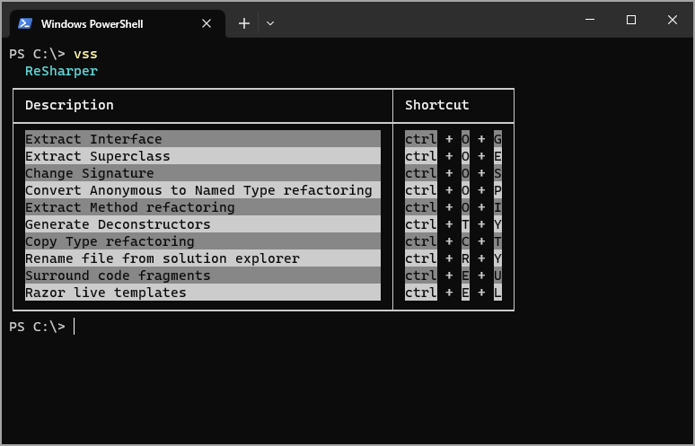

# About

A command line utility which reads a json file for Visual Studio shortcuts.

The idea is to place Visual Studio shortcuts that are rarely used which makes them easy to find from a command line or PowerShell.

> **Note**
> Current shortcuts are setup for the author's Jetbrains Resharper shortcuts hence the 'rs' in the file name vs2022rs.json

## Setup

1. Create a folder to place the shortcut file.
1. Copy JsonFiles\vs2022.json to the folder above.
1. Rename the file to the version of Visual Studio installed e.g. the current file is for VS2022, if using VS2019, name it to vs2019.json or you can simple name it vs.json
1. In FileOperations, adjust the property FileName to point to the json file
1. In the json file remove current shortcuts in place of your shortcuts.

## Next steps

1. Build the project
1. Run install.bat
1. From the command line type vss and ENTER

## Change source code

1. Run uninstall.bat
1. Make changes
1. Run install.bat